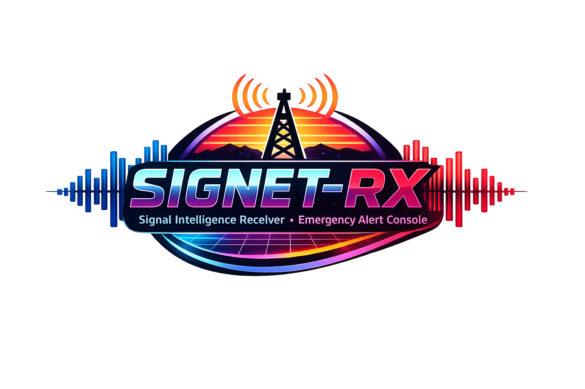

# SIGNET-RX (v1-beta)

⚠️ Very early beta: SIGNET-RX is still under active development; features may be incomplete and subject to change.



**Signal Intelligence Receiver & Broadcast Console**

SIGNET-RX turns a Raspberry Pi into a retro hi-fi style wideband receiver + NOAA SAME console with a live spectrum display (WFM Broadcast), alert override, and a web dashboard.


## Features

- **Wideband Receiver (WB RX)**
  - **WFM Broadcast** (true stereo planned) + **RDS** (station name + radio text)
  - **Manual RX** profile (planned): NFM/AM/SSB tuning controls (scanner features later)
- **NOAA Weather Radio (WX)** monitoring with **SAME** decoding
- Listening modes:
  - **WB + WX**: Wideband Receiver plays; NOAA overrides audio on alert
  - **WX LIVE**: continuous NOAA audio
  - **WX ALERT**: silent until an alert (then plays NOAA)
  - **SAME ONLY**: visual alerts only
- Dual display:
  - **HyperPixel 4.0** touch UI (primary)
  - **HDMI** UI (mirror or extended)
- Audio outputs:
  - Analog 3.5mm
  - HDMI audio
  - Bluetooth speaker (PipeWire)
- Retro hi-fi analyzer UI with a live audio spectrum (WFM Broadcast) and scrolling text
- HDMI idle visualization (Winamp-inspired)

## Recommended hardware

- Raspberry Pi 4 (2GB+; 4GB recommended)
- HyperPixel 4.0 (touch)
- 2x RTL-SDR (one for FM/RDS, one for NOAA SAME)
- FM antenna + VHF (162 MHz) antenna
- Optional: powered USB hub (recommended if running 2 dongles)
- SMA Y Splitter Cable (if running 2 dongles w/ 1 antenna)

## Status

This repository is a **v1-beta scaffold** meant to get you building on real hardware:
- UI updated for **WB RX + WX** layout (S-meter bar, bandwidth, modulation stack)
- Demo spectrum animation (no SDR required)
- Backend service that serves the UI and a demo event stream
- Installer + systemd units (placeholders)

The SDR decode pipelines are stubbed for now and will be wired up to:
- **WFM stereo + RDS** (GNU Radio flowgraph or equivalent)
- **WX audio + SAME** (`rtl_fm` + `multimon-ng`)

## Quick start (dev/demo)

On any Linux machine (including a Pi):

```bash
python3 -m venv .venv
source .venv/bin/activate
pip install -r requirements.txt
python -m signet_rx
```

Then open:
- http://localhost:8088

## Install on Raspberry Pi (planned)

```bash
sudo ./installer/install.sh
```

After install:
- Web UI: http://raspberrypi.local:8088
- Services: `signet-rx.service` and `signet-rx-kiosk.service`

## Configuration

Copy the example config and edit to taste:

```bash
sudo mkdir -p /etc/signet-rx
sudo cp config/signet-rx.example.env /etc/signet-rx/signet-rx.env
sudo nano /etc/signet-rx/signet-rx.env
```

Restart:

```bash
sudo systemctl restart signet-rx
```

## License

MIT (recommended for maker projects). See `LICENSE`.
